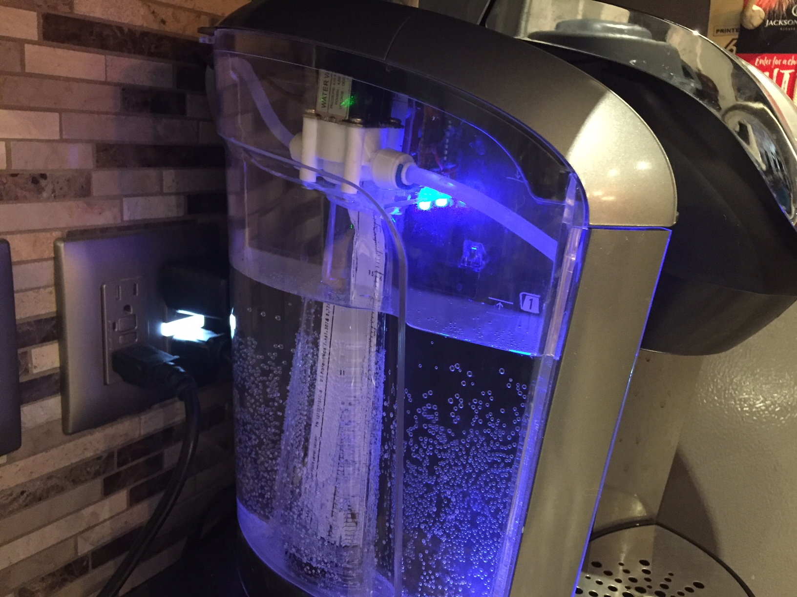
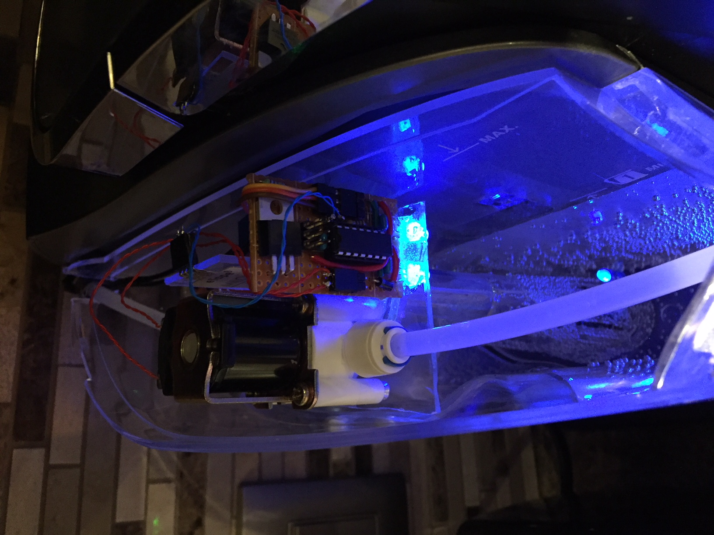

# keurig
Automatic water filling for keurig coffee maker

Simple microcontroller project that will automatically fill a keurig machine
with water when the tank gets low.  Based on ATtiny84 microcontroller, uses
3 I/O pins

- PA0 - analog input from eTape liquid level sensor to measure water level
- PB0 - output to 2 WS2818 RGB leds to indicate status
- PB1 - connected to Power MOSFET that turns on a water solenoid to fill the tank

**LED colour indications**

- Blue - tank is full
- Green - tank is filling up
- Yellow - tank is filling up, but is unexpectedly low
- Red - an error occurred, or the tank is really low/dry

**Error Conditions**

- tank is really low or dry
- tank has been filling up for more than 2 minutes

**Watchdog timer**

- software has a watch dog timer that will reset the microcontroller

**Programming (Makefile options)**

- the Makefile is set up to program the board via a bus pirate connected to
the ATtiny84 as a standard AVR ISP port (6pin)

**Sofware serial debug**

- includes a simple software serial debug, that allows printf to output strings
to a bus pirate connected to the ISP.

**Details of the hardware**

Basically I built a small plexiglass platform on top of the keurig filter 
in the tank.  Inside the filter is the 8" eTape liquid level sensor.  On 
the platform you'll see the 12V water valve solenoid connected to the 
water line via a standard ice-cube maker plastic 1/4" line.  You can
see the controller board beside the solenoid with the LEDs blue.

Behind the microcontroller board is a 5V to 12V buck convertor to provide
the power for the solenoid.

On the microcontroller board between the Power MOSFET and the ATtiny84 is
the 6 pin ISP connector.  I use a Bus Pirate to program the microcontroller 
when running the Makefile.  Also, I can minicom into the buspirate and put
it in RAW UART mode to receive the printf statements in the code while
debugging.

